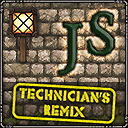

### John Smith Technician's Remix - Resource Pack

#### for GT New Horizons

---

Thank you for downloading this Resource Pack.

Please follow these instructions carefully.

NOTE:- This Resource Pack is designed for Minecraft version 1.7.x.

Releases for other versions of Minecraft can be found on our CurseForge page.

---

#### Installation Instructions

1. Run the Minecraft Launcher, log in and press the Play button.
2. On the Minecraft title screen select "Options"
3. Select "Resource Packs" (bottom left).
4. Select "Open Resource Pack folder" (also on the bottom left).
5. Place this folder into the "resourcepacks" folder.

---

#### Selecting the Resource Pack

1. Run the Minecraft Launcher, log in and press the Play button.
2. On the Minecraft title screen select "Options"
3. Select "Resource Packs" (bottom left).
4. Find "John Smith [32x] GT New Horizons" in the left column and click the arrow.
5. Click "Done"
